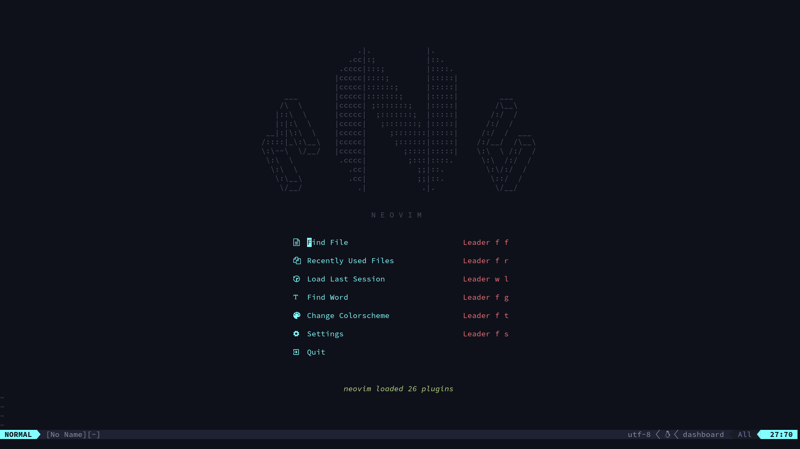
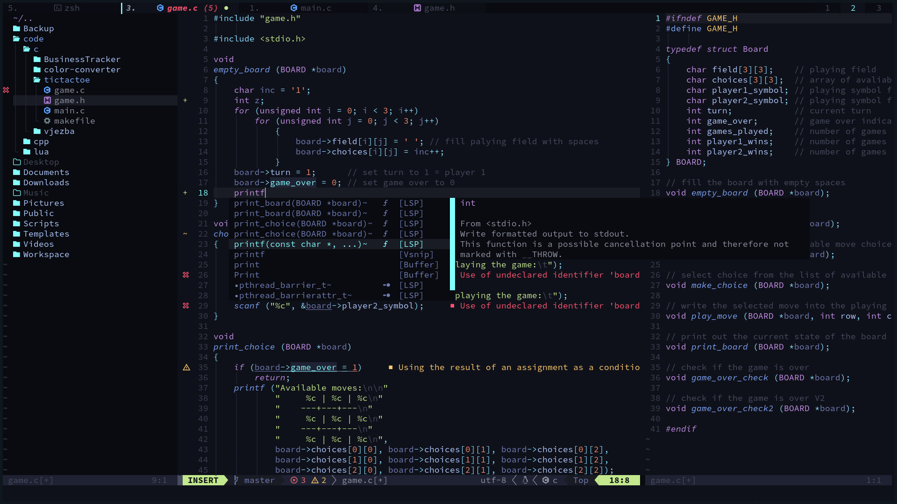
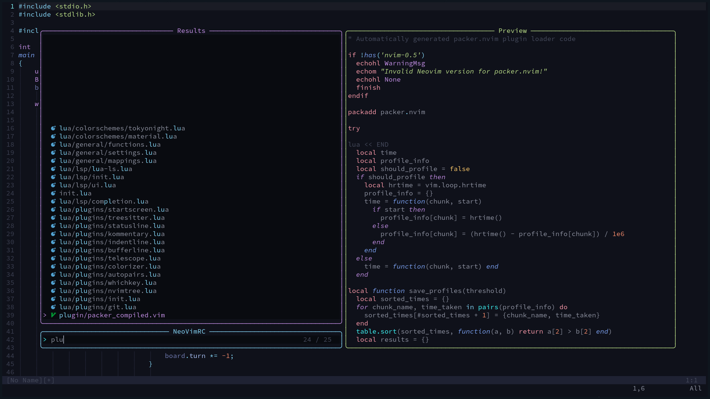

# neovim-config

```lua
--                       .|.            |.                        
--                     .cc|:;           |::.                      
--                   .cccc|:::;         |::::.                    
--                  |ccccc|::::;        |:::::|                   
--                  |ccccc|::::::;      |:::::|                   
--       ___        |ccccc|:::::::;     |:::::|         ___       
--      /\  \       |ccccc| ;:::::::;   |:::::|        /\__\      
--     |::\  \      |ccccc|  ;:::::::;  |:::::|       /:/  /      
--     |:|:\  \     |ccccc|   ;:::::::; |:::::|      /:/  /       
--   __|:|\:\  \    |ccccc|     ;:::::::|:::::|     /:/  /  ___   
--  /::::|_\:\__\   |ccccc|      ;::::::|:::::|    /:/__/  /\__\  
--  \:\~~\  \/__/   |ccccc|        ;::::|:::::|    \:\  \ /:/  /  
--   \:\  \          .cccc|         ;:::|::::.      \:\  /:/  /   
--    \:\  \           .cc|           ;;|::.         \:\/:/  /    
--     \:\__\          .cc|           ;;|::.          \::/  /     
--      \/__/            .|            .|.             \/__/      
--                                                                
--                                                                
--                          N E O V I M                           
```
          



