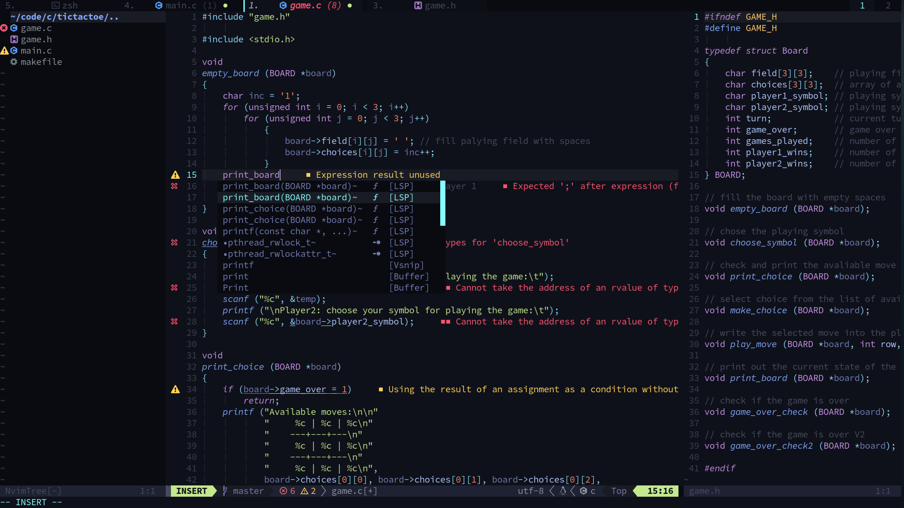

# neovim-config

   [ Marko Cerovac | NeoVim | config ]

           ___           ___
          /\  \         /\__\
         |::\  \       /:/  /
         |:|:\  \     /:/  /
       __|:|\:\  \   /:/  /  ___
      /::::|_\:\__\ /:/__/  /\__\
      \:\~~\  \/__/ \:\  \ /:/  /
       \:\  \        \:\  /:/  /
        \:\  \        \:\/:/  /
         \:\__\        \::/  /
          \/__/         \/__/
          

